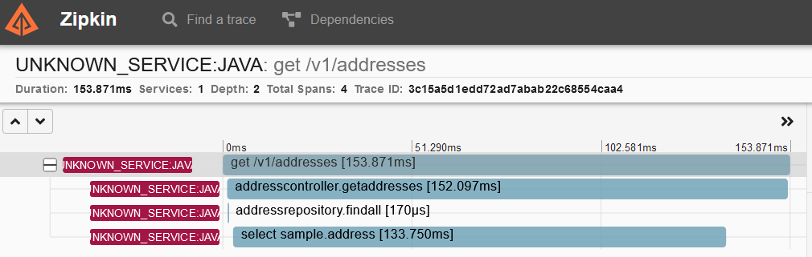

# Spring Data with R2DBC OpenTelemetry instrumentation issues demo project

## Pre-requisites

- `JAVA_HOME` pointing to Java 11+
- Docker installed and started
- Docker Compose installed and on PATH

## Getting Started

- clone the repository; `cd` into working directory
- run `./gradlew bootBuildImage`
- run `cd docker`
- run `docker compose up -d`
- make sure all the containers are shown as "Started" and/or "Healthy"
- open [http://localhost:9411/zipkin/](http://localhost:9411/zipkin/) in the browser
- click `Run Query`
- find the one that is annotated with `get /v1/addresses`
- click `Show` for that trace
- you should be seeing something like this: 

Note that the span annotated as `addressrepository.findall` is so short and both starts and ends BEFORE the actual SQL statement (span below it) begins and ends